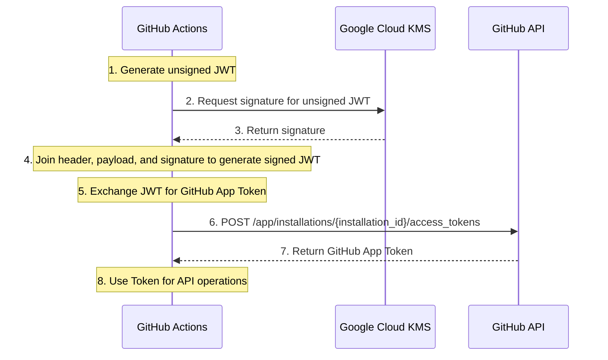

# yagihash/ghat

GitHub Action for creating GitHub App Token based on Google Cloud KMS.



## Example
```yaml
name: Sample yagihash/ghat

on:
  workflow_dispatch:

jobs:
  test:
    runs-on: ubuntu-latest
    timeout-minutes: 30
    permissions:
      contents: read
      id-token: write

    steps:
      - uses: google-github-actions/auth@7c6bc770dae815cd3e89ee6cdf493a5fab2cc093 # v3.0.0
        with:
          workload_identity_provider: your-workload-identity-provider-resource-name
          service_account: your-service-account

      - name: Run yagihash/ghat
        id: token
        uses: yagihash/ghat@042b6434b5b7a7ced04b50bdecd395ca0b51bd1d # v1.0.2
        with:
          app_id: your-github-app-id
          kms_key_id: your-kms-key-id
          kms_keyring_id: your-kms-keyring-id
          kms_location: your-kms-location e.g. asia-northeast1
          kms_project_id: your-google-cloud-project-id

      - name: Use token
        env:
          GH_TOKEN: ${{ steps.token.outputs.token }}
        run: |
          gh auth status
```

## How to set up KMS
### Create GitHub App
See [Creating GitHub Apps](https://docs.github.com/en/apps/creating-github-apps). Generate a private key of the GitHub App.

### Create Google Cloud KMS resources
Example terraform codes.

```terraform
resource "google_kms_key_ring" "github_app" {
  name     = "github-app-keyring"
  project  = "your-project-id"
  location = "your-preffered-region"
}

resource "google_kms_crypto_key" "github_app_signing_key" {
  name                          = "github-app-signing-key"
  key_ring                      = google_kms_key_ring.github_app.id
  purpose                       = "ASYMMETRIC_SIGN"
  import_only                   = true
  skip_initial_version_creation = true

  version_template {
    algorithm        = "RSA_SIGN_PKCS1_2048_SHA256"
    protection_level = "SOFTWARE" # Depends on what you run with your app
  }
}

resource "google_kms_key_ring_import_job" "github_app_keyring_import_job" {
  key_ring = google_kms_key_ring.github_app.id

  import_job_id = "github-app-key-import-job-1"

  import_method    = "RSA_OAEP_3072_SHA1_AES_256"
  protection_level = "SOFTWARE" # Depends on what you run with your app
}

resource "google_kms_crypto_key_iam_member" "gha_is_cloudkms_signer" {
  crypto_key_id = google_kms_crypto_key.github_app_signing_key.id
  role          = "roles/cloudkms.signer"
  member        = "serviceAccount:your-service-account"
}
```

### Import Your GitHub App Private Key
Example commands on macOS.

```bash
# Convert key format
openssl pkcs8 -topk8 -nocrypt -inform PEM -outform DER -in your-app.private-key.pem -out formatted-your-app-private-key.der

# It seems required
brew install cryptography

# Import key with wrapping encryption
CLOUDSDK_PYTHON_SITEPACKAGES=1 gcloud kms keys versions import \
  --import-job=github-app-key-import-job-1 \
  --location=your-location \
  --keyring=github-app-keyring \
  --key=github-app-signing-key \
  --algorithm=rsa-sign-pkcs1-2048-sha256 \
  --target-key-file=./formatted-your-app-private-key.der
```

## For other use-cases
You can use this for other general use-cases. I will include executables in releases later.

```bash
go install github.com/yagihash/ghat/cmd/ghat@latest

INPUT_KMS_PROJECT_ID=YOUR_GOOGLE_CLOUD_PROJECT_ID \
INPUT_KMS_KEYRING_ID=YOUR_KMS_KEYRING_ID \
INPUT_KMS_KEY_ID=YOUR_KMS_KEY_ID \
INPUT_KMS_LOCATION=YOUR_KMS_REGION \
INPUT_OWNER=YOUR_GITHUB_USER_OR_ORG_NAME \ 
INPUT_APP_ID=YOUR_GITHUB_APP_ID \ 
ghat

# with env vars
GH_TOKEN=$(ghat) gh auth status
```
